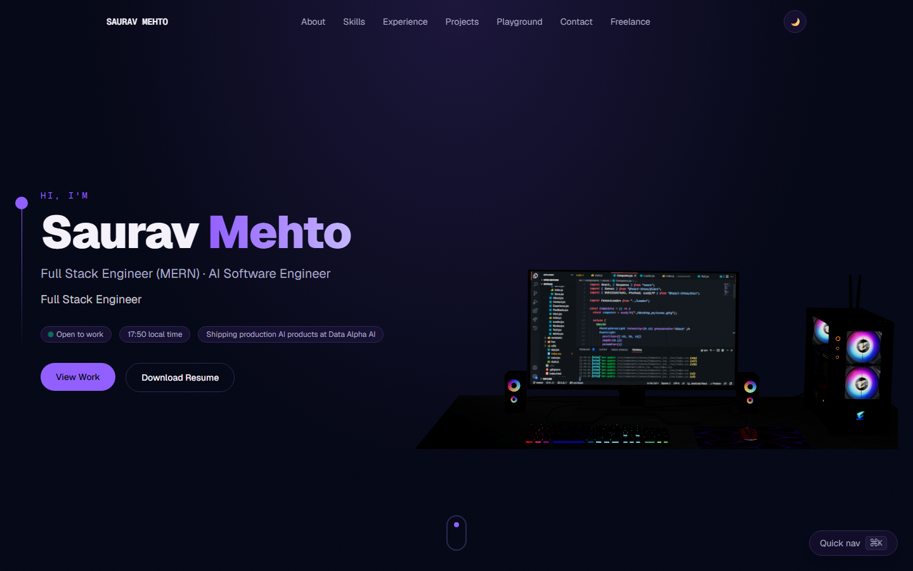
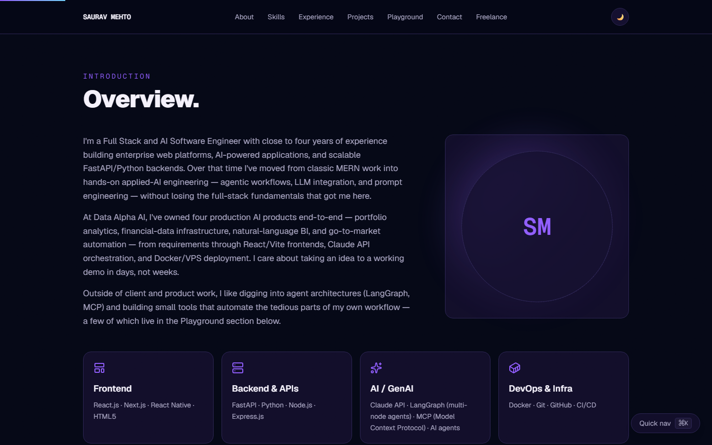
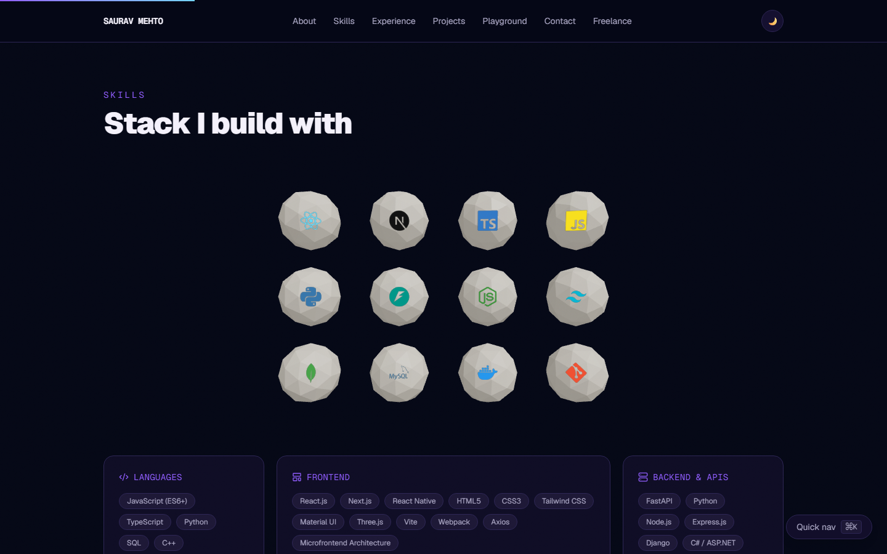
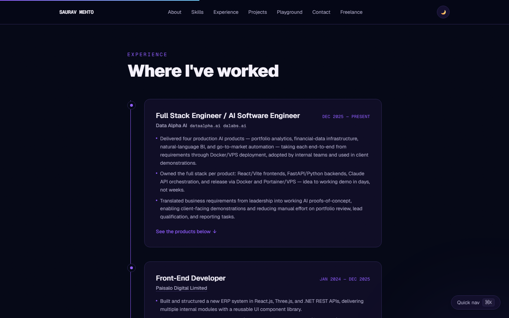
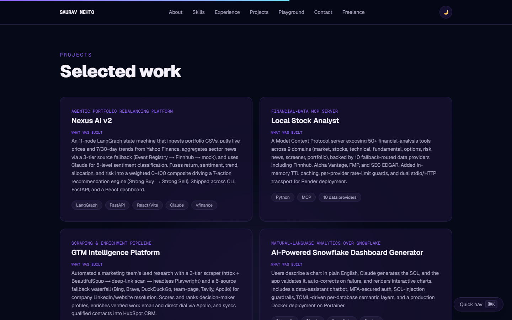
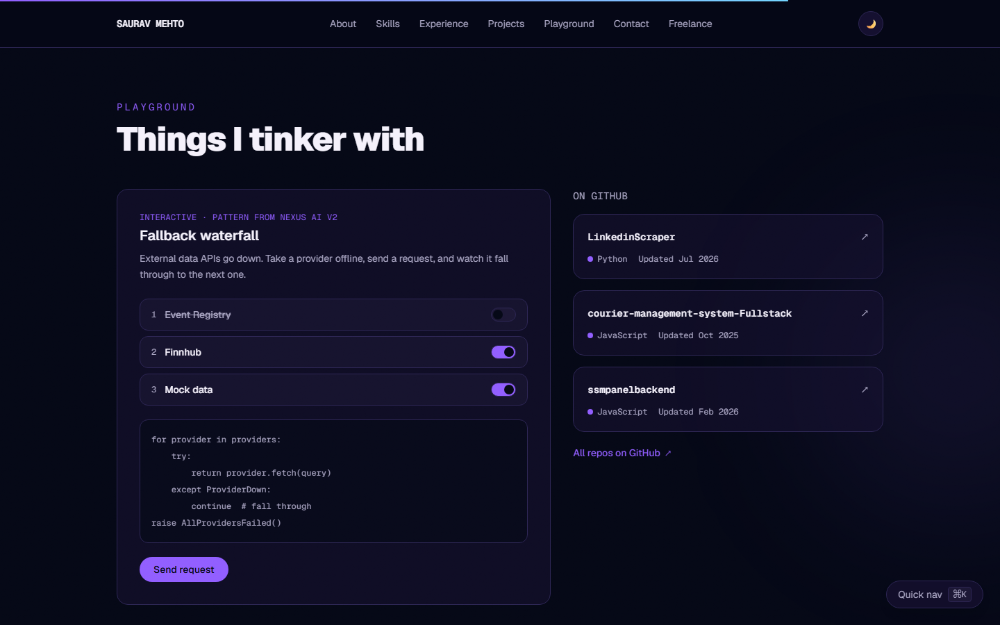
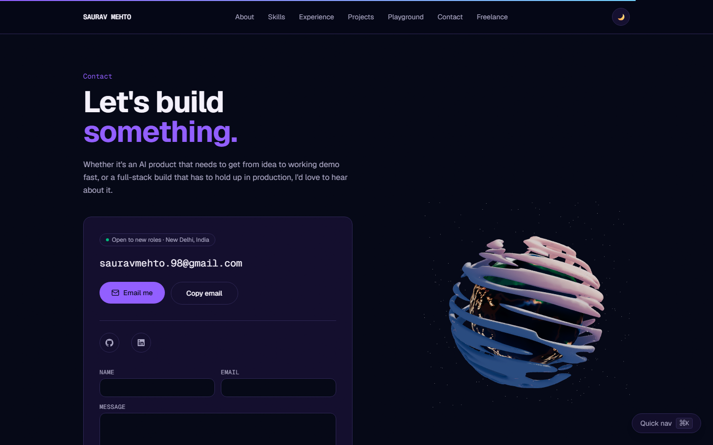
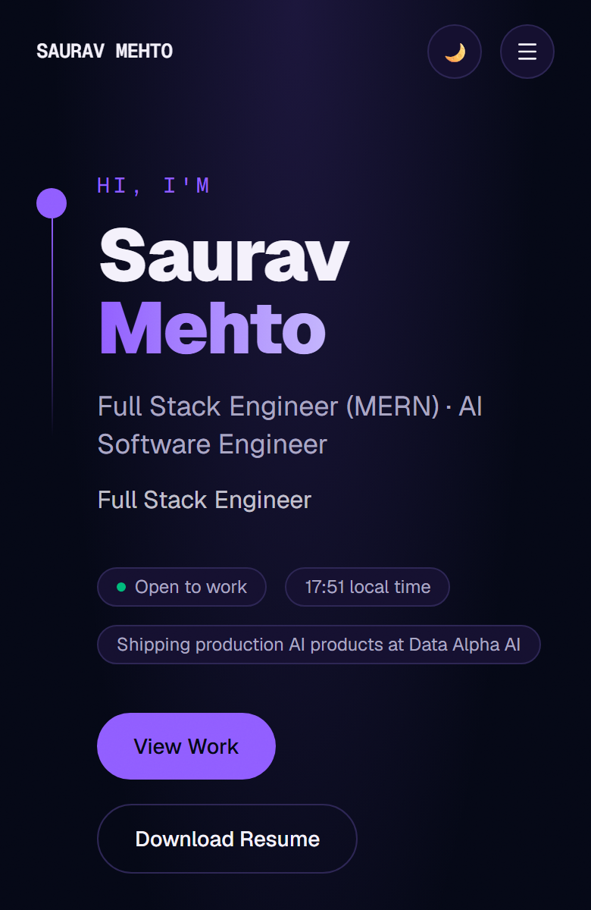

<div align="center">

# Saurav Mehto — Portfolio

**Full Stack Engineer (MERN) · AI Software Engineer**

A personal portfolio built with Next.js 16, React 19 and Three.js. It has interactive 3D scenes, live GitHub data, a working contact form and a moderated guestbook.




</div>

## Screenshots

| About | Skills |
| --- | --- |
|  |  |
| **Experience** | **Projects** |
|  |  |
| **Playground** | **Contact** |
|  |  |

<details>
<summary>Mobile</summary>
<br>

</details>

## Features

- **3D scenes.** The hero has a desktop PC model, the Skills section has a field of tech-logo balls that react to hover, and Contact has a stylized planet. All are built with React Three Fiber and drei.
- **Live GitHub repos.** The Playground lists selected repositories with language and last-push date, fetched from the GitHub API on the server and refreshed hourly.
- **Interactive demo.** The "fallback waterfall" lets visitors switch data providers off and watch a request fall through to the next one. It's the same pattern used in Nexus AI v2.
- **Contact form and guestbook.** Messages are stored in Postgres through Prisma and, optionally, emailed to me through Resend. Guestbook notes only appear on the site after I approve them. Both forms are validated with Zod and limited to one submission per minute per visitor (IP addresses are stored hashed).
- **Command palette.** Press <kbd>⌘K</kbd> / <kbd>Ctrl K</kbd> to jump to any section.
- **Motion.** Smooth scrolling with Lenis, scroll-reveal and parallax effects with Framer Motion and GSAP, a custom cursor, and a scroll-progress bar.
- **Light and dark themes** via `next-themes`.
- **SEO.** Open Graph image, sitemap, `robots.txt` and JSON-LD `Person` data, all generated by the app.
- **Freelance page** at `/freelance` for client work.

## Tech stack

| Area | Tools |
| --- | --- |
| Framework | Next.js 16 (App Router, Turbopack), React 19, TypeScript |
| Styling | Tailwind CSS 4 |
| 3D | Three.js, React Three Fiber, drei |
| Motion | Framer Motion, GSAP, Lenis |
| Data | Prisma 7, PostgreSQL (Neon), Zod |
| Email | Resend (optional) |
| Analytics | Vercel Analytics, Speed Insights |

## Getting started

You need **Node.js 20.9 or newer**.

```bash
git clone <this-repo-url>
cd web
npm install
cp env.example .env
npm run dev
```

Open <http://localhost:3000>.

The site runs without a database. If `DATABASE_URL` isn't set, the contact form and guestbook show a message asking visitors to email instead, and everything else works normally.

### Setting up the database

1. Create a Postgres database. The env example assumes [Neon](https://neon.tech).
2. Put its **pooled** connection string (the hostname contains `-pooler`) in `DATABASE_URL` in `.env`.
3. Create the tables:

   ```bash
   npx prisma migrate deploy
   ```

To approve a guestbook note, set `approved` to `true` on its row in the `Note` table. One way is to open `npx prisma studio`.

### Environment variables

| Variable | Required | Purpose |
| --- | --- | --- |
| `DATABASE_URL` | No | Postgres connection string for the contact form and guestbook. |
| `RESEND_API_KEY` | No | Also emails contact-form messages to you. Saving still works without it. |
| `RESEND_FROM` | No | Verified sender, e.g. `Portfolio <hello@yourdomain.com>`. |
| `NEXT_PUBLIC_SITE_URL` | No | Absolute site URL for Open Graph tags and the sitemap. Defaults to localhost. |
| `GITHUB_TOKEN` | No | Raises the GitHub API rate limit for the Playground repo list. |

## Scripts

| Command | What it does |
| --- | --- |
| `npm run dev` | Starts the dev server. |
| `npm run build` | Generates the Prisma client and builds for production. |
| `npm start` | Serves the production build. |
| `npm run lint` | Runs ESLint. |

## Editing the content

Almost all of the text lives in [`src/lib/site-config.ts`](src/lib/site-config.ts): name, role, bio, skills, experience, projects, featured GitHub repos, social links and the resume link. Edit it there instead of in the components.

To update the resume, replace [`public/Saurav_Mehto_Resume.pdf`](public/Saurav_Mehto_Resume.pdf) with a new file of the same name.

## Project structure

```
src/
├── app/              # Routes, layout, OG image, sitemap, robots
│   └── freelance/    # /freelance page
├── components/
│   ├── 3d/           # Three.js scenes (desktop PC, tech balls, planet)
│   ├── hero/ about/ skills/ experience/ projects/
│   ├── playground/   # Fallback-waterfall demo and GitHub repos
│   ├── contact/      # Contact form and guestbook
│   └── motion/       # Reveal, parallax, marquee and scroll helpers
├── lib/              # Site config, env, GitHub and database clients
└── server/           # Server actions and rate limiting
prisma/               # Schema and migrations
public/               # 3D models and resume
```

## Deployment

The site is set up for [Vercel](https://vercel.com). Import the repository, set the environment variables above, and deploy. The footer shows the short commit SHA and build date of the deployed version.

## Credits

The 3D models are used under CC-BY-4.0, and some visual patterns are adapted from an MIT-licensed template. See [THIRD_PARTY.md](THIRD_PARTY.md) for full attribution.

## Contact

- Email: [sauravmehto.98@gmail.com](mailto:sauravmehto.98@gmail.com)
- LinkedIn: [linkedin.com/in/saurav-mehto](https://linkedin.com/in/saurav-mehto)
- GitHub: [@Sauravmehto](https://github.com/Sauravmehto)
